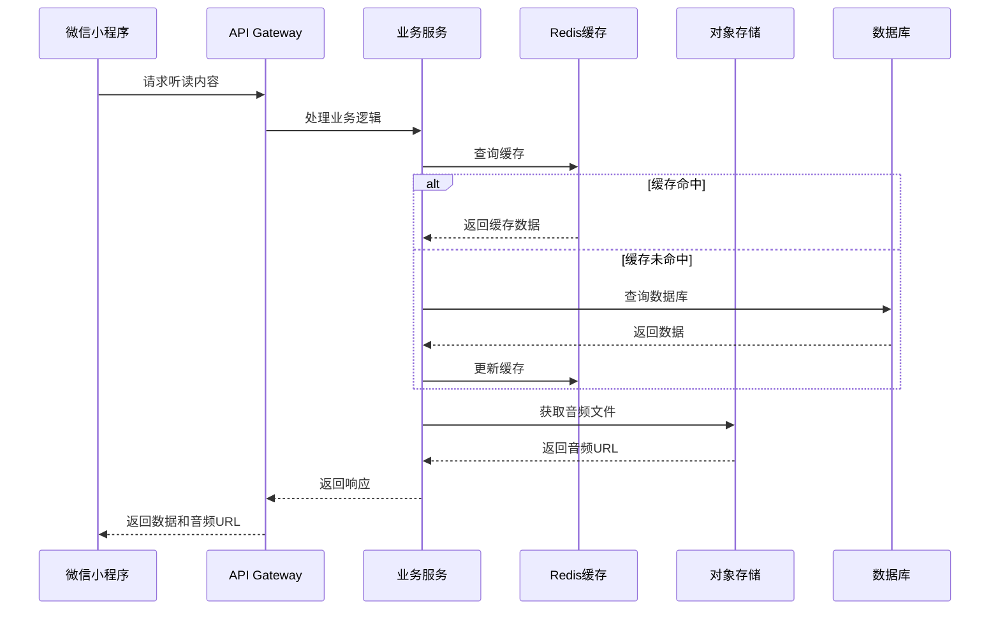
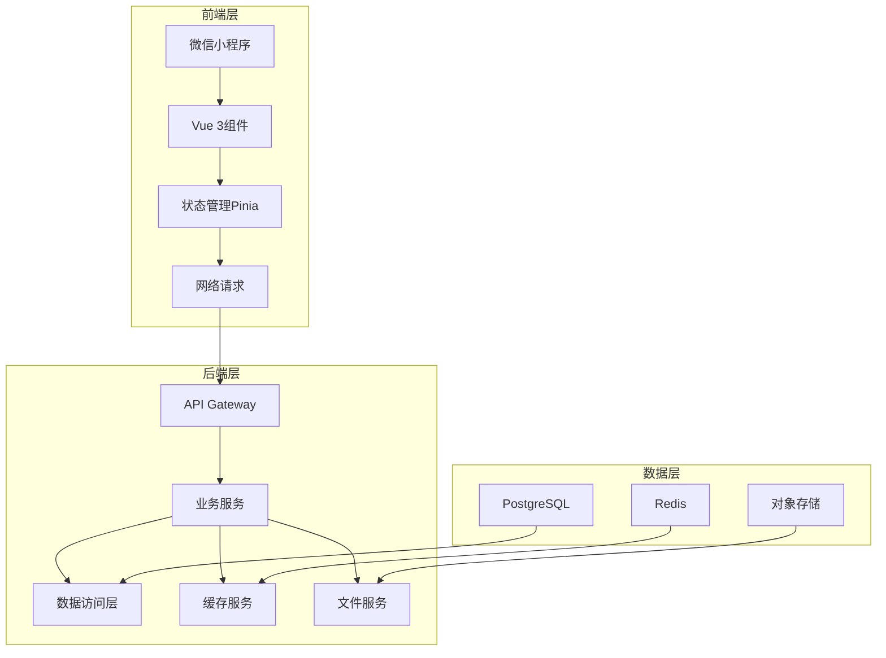

# 国学经典听读小程序 · 优化建议方案

> 基于现有方案的深度分析与优化建议
> 目标：打造沉浸式、高性能、可扩展的国学听读体验

---

# 一、现有方案分析

## 1. 优势评估

- **核心体验明确**：聚焦于“一句一个播放单元”的核心体验，强调顺滑播放和沉浸感
- **功能结构完整**：包含听读播放、断点续听、每日推荐、统计体系和收藏功能
- **数据库设计合理**：表结构设计清晰，关系明确，支持核心功能需求
- **交互细节考虑充分**：对播放状态机、高亮策略、自动滚动等细节有详细设计
- **开发优先级明确**：分阶段规划，确保核心功能优先实现

## 2. 优化空间识别

### 技术架构层面
- 缺乏明确的前后端分离架构设计
- 未提及技术栈选择和性能优化策略
- 音频处理和存储方案需要进一步明确
- 缺少缓存策略和并发处理方案

### 功能设计层面
- 个性化推荐算法较为简单（仅按顺序轮播或随机）
- 缺乏社交分享和互动功能
- 未考虑多角色适配（如儿童模式）
- 缺少离线缓存和网络异常处理

### 性能体验层面
- 音频加载策略需要优化（如预加载机制）
- 页面渲染性能需要提升（如虚拟列表）
- 交互流畅度需要进一步优化（如动画效果）
- 网络请求优化策略未提及

### 运营增长层面
- 用户增长策略不明确
- 内容运营计划需要细化
- 数据分析体系需要完善
- 缺少用户激励和留存机制

---

# 二、技术架构优化建议

## 1. 架构设计

### 前后端分离架构

### 技术栈选择

| 层级 | 技术 | 版本 | 选型理由 |
|------|------|------|----------|
| 前端 | 微信小程序 | 最新 | 原生支持，性能优异 |
| 前端框架 | Vue 3 | 3.x | 响应式数据，组件化开发 |
| 状态管理 | Pinia | 2.x | 轻量级，支持模块化 |
| 后端 | ASP.NET Core | 8.0+ | 高性能，跨平台，生态成熟 |
| 数据库 | PostgreSQL | 15.0+ | 强大的文本搜索能力，适合国学内容 |
| 缓存 | Redis | 7.0+ | 用于热点数据缓存和会话管理 |
| 对象存储 | 阿里云OSS | 最新 | 稳定可靠，CDN加速支持 |
| 认证 | 微信登录 | 最新 | 简化用户注册登录流程 |

## 2. 音频处理优化

### 音频存储策略
- **存储方案**：使用阿里云OSS存储音频文件，配合CDN加速
- **文件格式**：采用MP3格式，压缩比特率128kbps，平衡音质和大小
- **文件命名**：使用`book_id/chapter_id/sentence_id.mp3`的目录结构
- **备份策略**：多区域备份，确保数据安全

### 音频加载优化
- **预加载机制**：播放当前句时，预加载下两句音频
- **缓存策略**：小程序本地缓存最近播放的音频文件
- **断点续传**：支持音频文件的断点续传下载
- **降级策略**：网络不佳时，自动切换到低音质版本

## 3. 性能优化策略

### 后端性能
- **数据库优化**：使用索引，合理设计查询，避免全表扫描
- **缓存策略**：热点数据（如首页推荐、热门书目）缓存到Redis
- **并发处理**：使用异步编程和线程池优化并发请求
- **API优化**：实现HTTP/2，减少连接开销

### 前端性能
- **代码分割**：按需加载页面和组件
- **资源压缩**：压缩JS、CSS和图片资源
- **渲染优化**：使用虚拟列表渲染长句子列表
- **网络优化**：实现请求合并和缓存

---

# 三、功能设计优化建议

## 1. 核心功能增强

### 个性化推荐系统
- **推荐算法**：基于用户听读历史、偏好和热门程度的协同过滤算法
- **推荐维度**：
  - 基于听读时长的内容偏好
  - 基于收藏行为的兴趣点
  - 基于完成率的难度适配
  - 基于时间段的场景推荐（如睡前、晨起）
- **推荐展示**：每日推荐卡片，包含推荐理由

### 智能断点续听
- **多设备同步**：支持多设备间的播放进度同步
- **智能记忆**：不仅记录句子和秒数，还记录播放速度和音效设置
- **恢复策略**：打开小程序自动提示恢复上次播放

### 统计体系升级
- **多维度统计**：
  - 听读时长（日/周/月/年）
  - 完成章节数
  - 收藏数量
  - 连续听读天数
- **可视化展示**：使用图表展示听读趋势
- **成就系统**：基于统计数据解锁成就徽章

## 2. 社交互动功能

### 内容分享
- **分享形式**：
  - 单句分享（含音频）
  - 章节分享
  - 听读报告分享
- **分享内容**：生成带有原文、拼音和音频二维码的图片
- **分享激励**：分享后获得听读时长奖励

### 学习社区
- **打卡功能**：每日听读打卡，分享学习心得
- **评论互动**：对经典句子发表评论和感悟
- **学习小组**：创建或加入学习小组，共同进步

## 3. 多角色适配

### 儿童模式
- **界面优化**：更大的字体，更简洁的界面
- **内容筛选**：过滤不适合儿童的内容
- **家长控制**：设置每日听读时长限制
- **互动元素**：增加简单的互动游戏，增强学习兴趣

### 成人模式
- **深度内容**：提供更详细的注释和解读
- **学习计划**：支持自定义学习计划
- **进阶功能**：如跟读对比、背诵检测等

## 4. 离线功能

### 离线缓存
- **缓存策略**：
  - 自动缓存最近播放的章节
  - 支持手动下载指定章节
  - 智能管理缓存大小
- **离线播放**：无网络环境下正常播放已缓存内容
- **同步机制**：网络恢复后自动同步播放进度

### 网络异常处理
- **优雅降级**：网络不佳时，优先保证核心播放功能
- **智能重试**：网络波动时自动重试请求
- **用户提示**：清晰的网络状态提示和操作建议

---

# 四、用户体验优化建议

## 1. 视觉设计优化

### 配色方案
- **主色调**：采用典雅的中国传统色彩，如米色、棕色、墨色
- **功能色**：使用柔和的色彩区分不同功能区域
- **主题模式**：支持日间/夜间模式切换

### 排版设计
- **字体选择**：使用适合中文阅读的字体，如思源黑体
- **字号层级**：
  - 原文：24px~28px
  - 拼音：14px~16px
  - 注释：12px~14px
- **行距优化**：1.6~1.8倍行距，提升阅读舒适度

### 动画效果
- **过渡动画**：页面切换和元素变化使用平滑过渡
- **播放动画**：播放状态变化时的微妙动画效果
- **交互反馈**：所有用户操作都有明确的视觉反馈

## 2. 交互体验优化

### 播放控制优化
- **手势操作**：支持滑动切换句子，双击暂停/播放
- **语音控制**：支持简单的语音指令（如“下一句”、“暂停”）
- **播放速度**：支持0.5x~2x的播放速度调节
- **音效设置**：提供多种朗读风格选择

### 导航体验
- **底部导航**：固定底部导航栏，包含首页、听读、收藏、我的
- **顶部导航**：简洁的顶部导航，显示当前位置和核心操作
- **快捷操作**：常用功能支持快捷操作入口

### 加载体验
- **骨架屏**：页面加载时显示骨架屏，减少等待感
- **进度提示**：明确的加载进度提示
- **预加载**：智能预加载可能需要的内容

## 3. 无障碍设计

- **字体大小**：支持系统字体大小设置
- **色彩适配**：考虑色盲用户的色彩区分
- **操作反馈**：所有操作都有明确的反馈
- **辅助功能**：支持屏幕阅读器等辅助功能

---

# 五、运营与增长策略

## 1. 用户增长策略

### 获客渠道
- **微信生态**：利用微信好友分享、朋友圈、公众号等渠道
- **内容营销**：创建高质量的国学内容，吸引目标用户
- **合作推广**：与教育机构、文化团体合作推广
- **线下活动**：举办线下国学活动，提升品牌影响力

### 用户激励
- **注册奖励**：新用户注册送听读时长或专属内容
- **邀请奖励**：邀请好友注册获得奖励
- **连续打卡**：连续听读打卡获得额外奖励
- **成就系统**：解锁成就获得虚拟或实物奖励

## 2. 内容运营策略

### 内容规划
- **经典覆盖**：优先覆盖四书五经、唐诗宋词等核心经典
- **内容分级**：根据难度分级，满足不同用户需求
- **音频质量**：邀请专业播音人员录制，确保音频质量
- **内容更新**：定期更新内容，保持用户新鲜感

### 专题策划
- **节日专题**：结合传统节日推出相关内容
- **季节专题**：根据季节变化推荐合适的内容
- **主题专题**：如“修身养性”、“为人处世”等主题

## 3. 数据分析体系

### 数据指标
- **核心指标**：
  - 日活跃用户数（DAU）
  - 听读时长
  - 留存率
  - 转化率
- **行为指标**：
  - 播放完成率
  - 分享率
  - 收藏率
  - 功能使用率

### 分析工具
- **数据采集**：使用埋点和日志收集用户行为数据
- **数据分析**：使用专业数据分析工具进行深度分析
- **可视化**：构建数据看板，实时监控关键指标

### 数据驱动决策
- **A/B测试**：通过A/B测试优化产品功能
- **用户画像**：基于数据构建用户画像，精准定位用户需求
- **内容推荐**：基于用户行为数据优化推荐算法

---

# 六、技术实施计划

## 1. 开发阶段规划

### 阶段一：核心功能实现（1-2个月）
- 基础架构搭建
- 核心听读功能实现
- 数据库设计与实现
- 音频处理系统搭建

### 阶段二：功能增强（2-3个月）
- 个性化推荐系统
- 社交分享功能
- 多角色适配
- 离线缓存功能

### 阶段三：体验优化（1-2个月）
- 性能优化
- 视觉设计优化
- 交互体验优化
- 无障碍设计

### 阶段四：运营增长（持续）
- 用户增长策略实施
- 内容运营计划执行
- 数据分析体系搭建
- 持续迭代优化

## 2. 关键技术挑战与解决方案

### 音频处理
- **挑战**：音频文件存储和加载性能
- **解决方案**：使用对象存储+CDN，实现预加载和缓存策略

### 个性化推荐
- **挑战**：冷启动问题和推荐精度
- **解决方案**：结合内容特征和用户行为，使用协同过滤算法

### 性能优化
- **挑战**：长列表渲染和音频播放卡顿
- **解决方案**：使用虚拟列表，优化音频加载策略

### 多设备同步
- **挑战**：不同设备间的播放进度同步
- **解决方案**：使用云端存储播放进度，实时同步

## 3. 质量保证计划

### 测试策略
- **单元测试**：覆盖核心业务逻辑
- **集成测试**：测试各模块间的交互
- **端到端测试**：测试完整的用户流程
- **性能测试**：测试系统在高并发下的表现

### 监控体系
- **应用监控**：监控应用崩溃和错误
- **性能监控**：监控页面加载时间和响应速度
- **业务监控**：监控核心业务指标

---

# 七、总结与建议

## 1. 核心优势

- **明确的产品定位**：聚焦于沉浸式国学听读体验
- **完整的功能设计**：涵盖核心听读需求和扩展功能
- **详细的交互设计**：注重用户体验细节
- **合理的技术架构**：支持高性能和可扩展性

## 2. 优化重点

- **技术架构**：采用前后端分离，优化音频处理和存储
- **功能设计**：增强个性化推荐，添加社交互动，支持多角色适配
- **用户体验**：优化视觉设计和交互体验，提升沉浸感
- **运营增长**：制定明确的用户增长和内容运营策略

## 3. 实施建议

- **优先实现核心功能**：确保听读播放、断点续听等核心功能的稳定性和性能
- **迭代式开发**：采用敏捷开发方法，快速迭代，持续优化
- **用户反馈驱动**：重视用户反馈，及时调整产品方向
- **数据驱动决策**：基于数据分析结果进行产品优化

## 4. 未来展望

- **AI 赋能**：引入AI技术，如智能语音合成、个性化推荐、情感分析等
- **多平台扩展**：考虑扩展到其他平台，如APP、Web等
- **生态建设**：构建国学学习生态，如在线课程、社区互动等
- **商业模式**：探索多元化的商业模式，如会员服务、内容付费等

---

# 八、附件

## 1. 技术架构图

## 2. 数据库优化建议

### 索引优化
- 在`user_listen_progress`表的`user_id`和`book_id`字段上创建复合索引
- 在`user_listen_record`表的`user_id`和`listen_date`字段上创建复合索引
- 在`classic_sentence`表的`chapter_id`和`order_index`字段上创建复合索引

### 分表策略
- 对于`user_listen_record`表，考虑按月份分表，提高查询性能
- 对于`classic_sentence`表，考虑按`book_id`分表，减轻单表压力

## 3. 性能指标目标

| 指标 | 目标值 | 测量方法 |
|------|--------|----------|
| 页面加载时间 | < 1s | 使用性能监控工具 |
| 音频加载时间 | < 0.5s | 模拟不同网络环境测试 |
| 播放流畅度 | 无卡顿 | 用户体验测试 |
| 并发处理能力 | 1000 QPS | 压力测试 |
| 缓存命中率 | > 80% | 监控缓存使用情况 |

## 4. 风险评估与应对策略

| 风险 | 影响 | 应对策略 |
|------|------|----------|
| 音频版权问题 | 法律风险 | 确保使用合法授权的音频资源 |
| 内容质量问题 | 用户体验 | 建立严格的内容审核机制 |
| 技术性能问题 | 系统稳定性 | 提前进行性能测试和优化 |
| 用户增长缓慢 | 业务发展 | 制定有效的用户增长策略 |
| 竞争加剧 | 市场份额 | 持续创新，提升产品差异化 |

---

**结语**：通过以上优化建议，我们可以打造一个更加沉浸式、高性能、可扩展的国学经典听读小程序，为用户提供优质的国学学习体验，同时为产品的长期发展奠定坚实的基础。